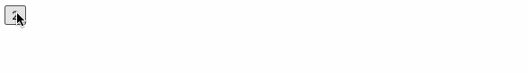
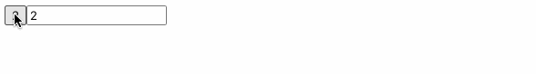
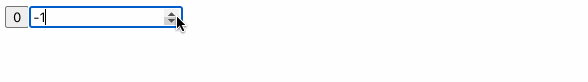

# Event Binding

### Counter

* Maak een counter component aan.
* Voorzie de klasse van een&#x20;
  * **property**: "counter" met het type number, initialiseer op 0
  * **Method:** increment() die de counter met 1 verhoogd
* Voeg een HTML button toe aan de template
  * Bind het click event aan de Increment() functie (event binding)
  * Bind de **textContent** property aan de counter poperty van de klasse (property binding)
* **Test...**

* Voeg bij de button nog een input veld (type number) toe.
* Bind de value hiervan aan de counter property (aan de hand van property binding)
* Wijzig de waarde in het input veld... is het resultaat zoals verwacht?

**Uitbreiding:**

* Gebruik het input veld en de button van de vorige oefening
* Verwijder de bindings
* Zorg er nu voor dat de waarde die de gebruiker heeft ingevoerd wordt doorgegeven naar de klasse op het moment dat de knop wordt ingedrukt.
  * Gebruik hierbij een “template reference variable” voor het input veld.
  * Geef de waarde door naar de counter property van de klasse mbv. een nieuwe **SetCounter**() method.
  * Bind de textContent property van de button aan de counter property van de klasse.

### Red Box

* Voeg een HTML **div** element toe
* Style het div element zodat het bv. een breedte & hoogte heeft van 200px; en een background color : red
* Bind het mousemove event met de **DoSomething** functie in de klasse
* In deze functie worden de “mouse coordinates” naar een string geformateerd als: “x / y” en gestockeerd in de property coords.
* Toon deze coords property in het div element mbv. Interpolation

