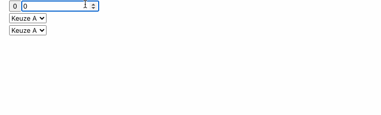

# Two-way binding

### Counter

Pas de counter van het onderdeel event binding aan (met uitbreiding)

Voeg een HTML select element toe.

Voeg enkele opties toe en bind eveneens aan de 'counter' property (2 way binding)

Kopieer de input en test...

Indien het niet werkt, check even of je FormsModule niet bent vergeten toe te voegen.

Pas het input element aan zodat het ook werkt met 2-way binding.

Test het in combinatie met de select elementen.

### Welcome screen

Pas het “welcome” scherm aan zodat er een keuzelijst (select) wordt getoond waarmee de gebruiker rechtstreeks een afbeelding kan selecteren.&#x20;

Uiteraard blijven de afbeeldingen nog wel na 5 seconden wisselen en zal de keuzelijst steeds volgen en de huidige getoonde afbeelding weergeven.

Bouw de keuzelijst op met een \*ngFor aan de hand van een lijst in de klasse

### Persoonsgegevens

**Stap 1:**

* Voorzie een component met enkele velden om persoonsgegevens in te vullen
* Bind deze velden aan een persoonsobject (werkt met een interface) via 2-way binding
* Geef de ingevulde velden onderaan terug weer mbv. interpolation
* Terwijl de gegevens worden ingevuld dienen ze dus onderaan reeds te verschijnen.

**Stap 2:**

* Voorzie een knop "Bewaren"
* geef de ingevulde gegevens pas volledig weer nadat er op de knop werd gedrukt

