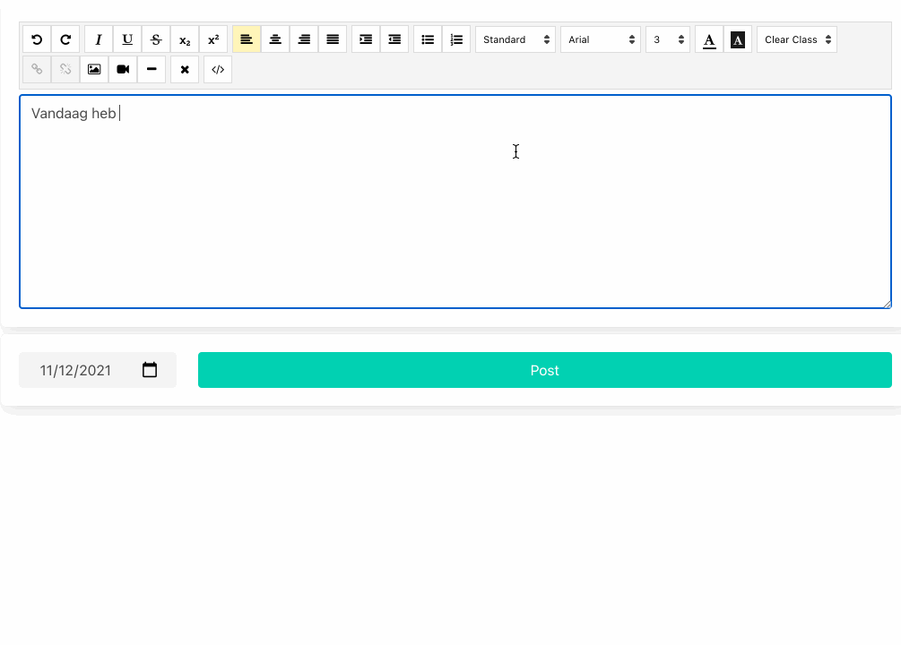

# MongoDB

### Pokemon

* Maak een nieuwe database met bijbehorende collection Pokemon aan in je lokaal geïnstalleerde MongoDB.
* Pas je nest applicatie aan zodat ze verbinding maakt met de mongodb database.&#x20;
* Zorg ervoor dat de collection wordt gevuld met pokemon uit het json bestand als deze leeg is.
* Pas alle routes aan (GET,POST,DELETE en PUT) zodat ze gebruik maken van de mongodb database
* Je hebt dus de routes
  * GET /pokemon&#x20;
  * GET /pokemon/:id
  * POST /pokemon
  * PUT /pokemon/:id
  * DELETE /pokemon/:id
* We gebruiken dus een insert, select, delete en update
* Zorg ervoor dat je angular pokedex applicatie deze nieuwe API aanspreekt ipv je json-server
  * Zorg dat je een pokemon kan **verwijderen**, **togglen** als favorite en **aanpassen.**

### Dagboek

We gaan in deze opdracht een webapplicatie bouwen om een dagboek te beheren. Je moet een dagboek invullen, een toevoeging kunnen verwijderen en kunnen aanpassen aan de hand van een angular applicatie. De backend zal gemaakt worden aan de hand van nest.js + mongodb.&#x20;

#### NestJS API + MongoDB

* Maak een nieuwe nest.js applicatie.&#x20;
* Zorg voor een nieuwe database en collection met de naam: **journal**
* Alle gegevens moet uit de database komen

Zorg voor de volgende routes:

**GET `/posts`**&#x20;

Voorbeeld response:

```
[
  {
    "_id": "61b5255a36d297988aa0a159",
    "text": "Vandaag heb ik een angular applicatie geschreven... <b><i><u>Het was super leuk!</u></i></b>",
    "date": "2021-12-11T22:24:36.174Z"
  },
  {
    "_id": "61b5256736d297988aa0a15a",
    "text": "Gisteren ook met angular bezig geweest!&#160;",
    "date": "2021-12-10T00:00:00.000Z"
  }
]
```

De \_id hier wordt voorzien door mongodb

**POST /posts**

Voorbeeld request body:

```
{
    "text": "Vandaag was het mijn verjaardag <b><i><u>Het was super leuk!</u></i></b>",
    "date": "2021-13-11T22:24:36.174Z"
  }
```

Voorbeeld response:

```
{
  "text": "Vandaag was het mijn verjaardag... <b><i><u>Het was super leuk!</u></i></b>",
  "date": "2021-13-11T22:24:36.174Z",
  "_id": "61b6523b6ee38680f102725e"
}
```

**DELETE /posts/:id**

Geen request body en response 204 bij succesvolle delete.

**PUT  /posts/:id**

Voorbeeld request body:

```
{
    "text": "Vandaag was het mijn verjaardag! <b><i><u>Het was super leuk!</u></i></b>",
    "date": "2021-13-11T22:24:36.174Z"
}
```

Voorbeeld response:

```
{
  "text": "Vandaag was het mijn verjaardag! <b><i><u>Het was super leuk!</u></i></b>",
  "date": "2021-13-11T22:24:36.174Z",
  "_id": "61b6523b6ee38680f102725e"
}
```

#### Angular

* Maak gebruik van bulma framework en fontawesome&#x20;
* Maak een nieuwe angular applicatie aan
* Installeer de angular wysiwyg editor module
  * [https://www.npmjs.com/package/@kolkov/angular-editor](https://www.npmjs.com/package/@kolkov/angular-editor)
* Zorg ervoor dat je de verschillende API endpoints kan aanspreken aan de hand van je angular applicatie.
* De applicatie moet er als volgt uitzien:



