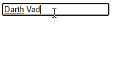
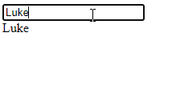
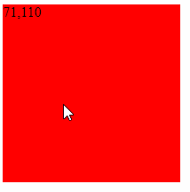
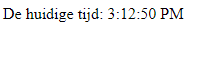
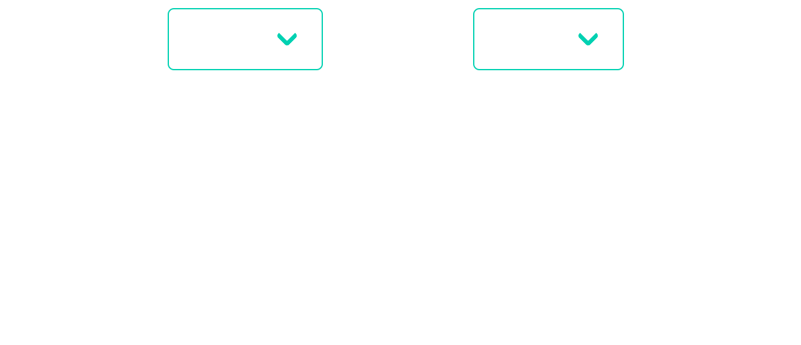
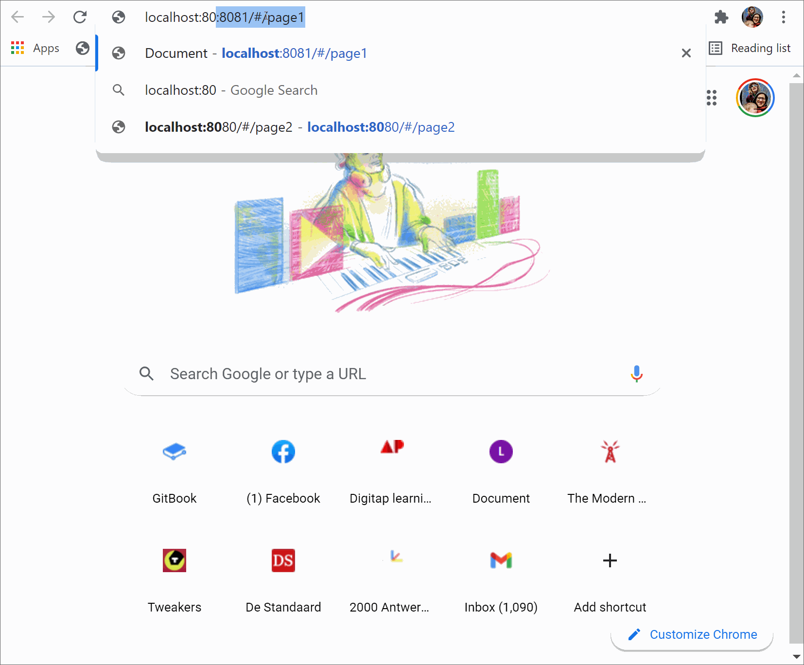

# JavaScript


Host je pagina's op een locale webserver (bv. http-server op npm). Anders gaan sommige oefeningen niet werken.


**Oef 1:** Bouw een HTML-pagina waarin je een invoer veld voorziet en een tekst (label).

Zorg dat na het ingeven van het woord in het invoer veld en de cursor het veld verlaat (dus bv. met de 'tab' toets), dit ook wordt weergegeven in de label.



**Oef 2:** zelfde als oef1, maar het woord wordt onmiddellijk weergegeven tijdens in het invoeren.



**Oef3:** Toon een gekleurd vierkant en geef de muis coördinaten weer als men over het vierkant beweegt. 0/0 is de linker bovenhoek, 200/200 is de rechter onderhoek.



**Oef 4:** Geef de huidige tijd weer:



**Oef 5:**

* Voeg het Bulma CSS framework toe aan je project [http://bulma.io](http://bulma.io)&#x20;
*   Test of het effectief ook werkt, gebruik HTML voorbeeld code uit de documentatie van bulma.

    Bv. enkele “button”s en een “Box” (vind je beide bij Elements)


**Oef 6:**

* Voorzie 2 dropdown lijsten (om een Bulma gestylde lijst te bekomen zoek je in de documentatie bij de rubriek '**Form**' en vervolgens '**Select**' )
* Lijst 1 geeft enkele automerken weer.
* Lijst 2 geeft enkele kleuren weer
* Voorzie in elke lijst tevens een 'lege' keuze
* Bij het selecteren van een automerk zal er automatisch een willekeurige kleur worden gekozen. Er verschijnt tevens een tekst bericht ter bevestiging.
* Bij het selecteren van een (andere) kleur zal er enkel een tekstbericht worden getoond.
* Het tekstbericht verdwijnt automatisch na 2 seconden.&#x20;




**Oef 7:**


Gebruik voor deze oefening maar 1 html pagina. Deze oefening is om de werking van een single page application te demonstreren.


* Maak twee Bulma cards (je vindt deze onder Componenten op de bulmba web site). Geef bij het openen van de pagina enkel de eerste card weer. Voorzie 2 buttons waarmee je vooruit en achteruit kan navigeren.
* Zorg ervoor dat de knoppen op de juiste pagina gedisabled worden. Als men zich bevindt op pagina 1 dan moet enkel 'Pagina 2' actief zijn en omgekeerd
* Laat de navigatie samenwerken met de browser history knoppen (back en forward). Tip: gebruik hiervoor `history.pushState`
* Zorg ervoor dat de url van je applicatie aangepast wordt als je klikt op de navigatie elementen. Je kan deze meegeven aan de derde parameter van de `pushState` methode. De urls zullen er als volgt uit zien: `/#/page2` en `/#/page1`
* Zorg dat de gebruiker pagina 1 te zien krijgt als hij naar `/#/page1` surft en dat hij pagina 2 te zien krijgt als hij naar `/#/page2` surft.




**Oef 8:**

* Bouw verder op de vorige oefening. Maak bij een **derde pagina** aan(/#/page3).
* Maak een nieuw html bestand met een tabel in.
* Doe een AJAX call naar deze locatie op je webserver en injecteer deze tabel in een div op je derde pagina. Je kan deze AJAX call bij het laden van jouw pagina starten.

.png>)

**Oef 9:**

* Bouw verder op de vorige oefening. Maak een vierde pagina aan (/#/page4).
* Voorzie een text bestand met data. Deze date bevat nu uiteraard steeds dezelfde vaste waarden, maar zou even goed uit een databank op de server kunnen komen.
* Deze data bevat een aantal waarden over de gemiddelde consumptie van dranken. Elke drank heeft een percentage: koffie = 10%, thee = 20%,...

```
coffee,10;tea,20;lemonade,30;beer,45;wine,32;whiskey,88
```

* Haal deze data op via een ajax call en vorm ze om met javascript naar een html weergave. Je kan gebruik maken van Bulma voor het in progress bars te laten zien.

.png>)
