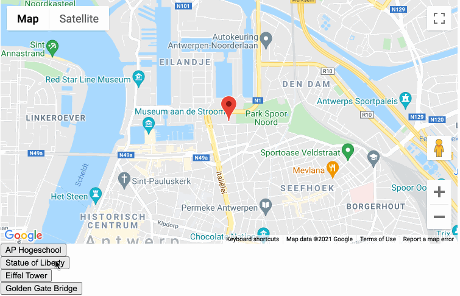
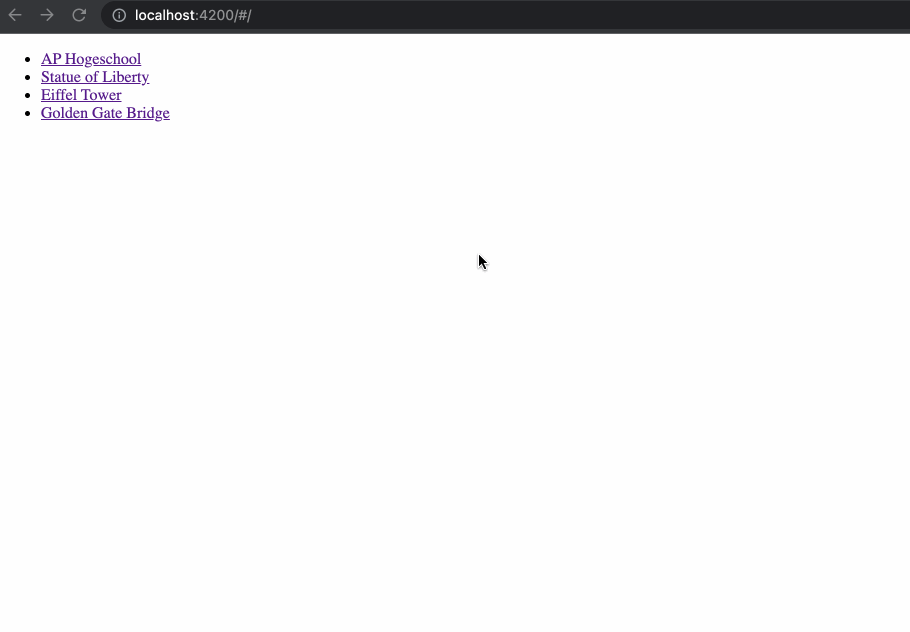

# Google Maps

* Installeer de ng maps module aan de hand van de volgende commando's:

```bash
npm install @ng-maps/core --force
npm install @ng-maps/google --force
```

* Om google maps te gebruiken moet je twee modules initialiseren:

```typescript
NgMapsCoreModule,
NgMapsGoogleModule.forRoot({
  apiKey: "GoogleMapsKey"
})
```

* Voor het gebruik van de library kan je de documentatie raadplegen op: [https://ng-maps.github.io/core/index.html](https://ng-maps.github.io/core/index.html)
* Zorg voor een aantal locaties op je kaart die je met een map marker aangeeft.
* Onderaan de map staan een aantal knoppen per locatie. Als je er op klikt gaat de kaart naar die locatie.



### Uitbreiding

* Zorg voor twee routes
  * /locations
  * /map/:location
* De locations route toont een lijst met mogelijke locaties
  * Plaats deze best in een aparte file
  * Als je er op klikt ga je naar /map/:location
* De map route toont gewoon de map zoals in de basis opdracht
  * De naam van de locatie lees je uit de parameter location



