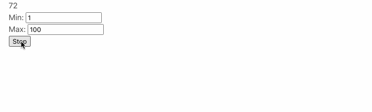
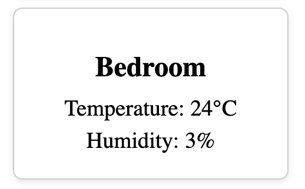
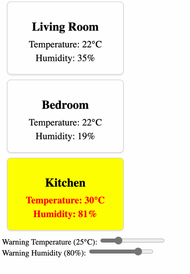

# Parent Child

### Random Numbers

Maak twee componenten:

* Component 1:
  * Deze component genereert zelf voortdurend willekeurige getallen
  * Het minimum en maximum getal is instelbaar via publieke properties
  * het moet ook mogelijk zijn om het component te stoppen en starteren
* Component 2:
  * Deze component bevat 2 invulvelden min en max
  * Alsook een toggle button (checkbox, switch,...)
  * Component 1 wordt getoond in component 2
* De invoer van de gebruiker wordt gebruikt om component 1 te sturen (min, max, start en stop)



### Todo Child

* Gebruik het todo lijstje als child component
* Zorg ervoor dat je vanuit de parent de volgende dingen kan instellen:
  * Title (default: todo lijstje)
  * Max. aantal items in delijst (standaard 0, dwz onbeperkt!)

## Sensors

Maak een array van sensoren met de volgende waarden:
- Living Room: 23°C, 40% humidity
- Bedroom: 21°C, 50% humidity
- Kitchen: 25°C, 45% humidity

Je kan hiervoor de volgende interface gebruiken om de objecten te beschrijven:

```typescript
export interface Sensor {
  name: string;
  temperature: number;
  humidity: number;
}
```

Zorg ervoor dat de data van de sensoren om de 5 seconden geüpdatet wordt met willekeurige waarden. Gebruik hiervoor de lodash library.

Maak een nieuw component `SensorComponent` die de data van de sensor toont. Gebruik een `@Input` om de sensor door te geven aan het component.



Gebruik een `@for` loop om de sensoren te tonen in de `AppComponent`.

Voeg vervolgens een twee invoer velden toe waarbij de gebruiker een range kan instellen voor de temperatuur en de luchtvochtigheid. Als de temperatuur of luchtvochtigheid van een sensor boven de ingestelde waarde komt, moet de achtergrond van de sensor geel worden en de tekst van de desbetreffende sensor rood. Je moet deze waarden doorgeven aan de `SensorComponent` via een `@Input`.

