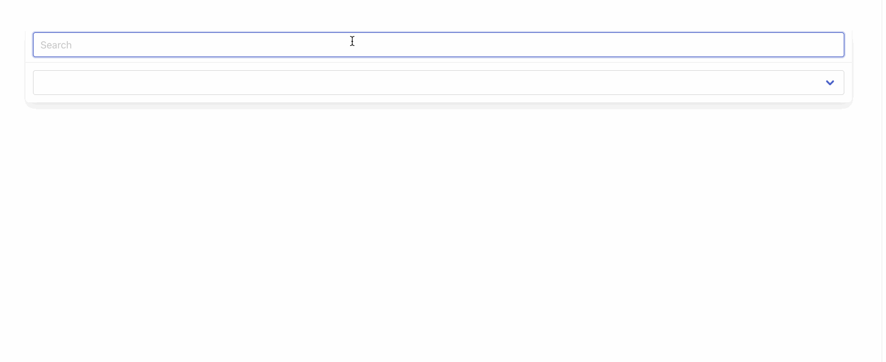

# HttpClientModule

### Pokedex

* Gebruik json-server om van de pokemon.json een mock REST API te maken
  * [https://github.com/typicode/json-server](https://github.com/typicode/json-server)
  * Pas je **pokedex.json** aan zodat je een object hebt met daarin een array van pokemon. Anders kan json-server hier niet mee werken.&#x20;
  * Het bestand zal er ongeveer als volgt uitzien:

```
{
    "pokemon": [
        {
            "id": "1",
            "species_id": "1",
            "height": "7",
            "weight": "69",
            "base_experience": "64",
            "order": "1",
            "is_default": "1",
            "name": "bulbasaur",
            "sprites": {
                "normal": "http://img.pokemondb.net/sprites/black-white/normal/bulbasaur.png",
                "animated": "http://img.pokemondb.net/sprites/black-white/anim/normal/bulbasaur.gif"
            }
        },
        ...
    ]
}
```

Voer het commando uit om de json-server te starten:

* **npx json-server src/assets/pokedex.json**

Je kan nu de API endpoints aanspreken via postman:


* Pas de pokedex service aan zodat je nu gebruik maakt van deze webservice.&#x20;
* Maak gebruik van promises

### De Lijn

* Gebruik 'de lijn' API om een component te bouwen dat voor een bepaald halte nummer de vertrekken laat zien.

[**https://portal.delijn.be/api-details#api=KernOpenDataServicesV1\&operation=get-haltes-entiteitnummer-haltenummer-real-time**](https://portal.delijn.be/api-details#api=KernOpenDataServicesV1\&operation=get-haltes-entiteitnummer-haltenummer-real-time)

Je hebt voor deze API een subscription key nodig. Je kan deze toevoegen als tweede parameter van je get:

```
{headers: {"Ocp-Apim-Subscription-Key": "c789b014acc84b53adc4e3058d248e14"}
```

* Voorbeeld serviceURL: [https://api.delijn.be/DLKernOpenData/api/v1/haltes/1/200144/real-time](https://api.delijn.be/DLKernOpenData/api/v1/haltes/1/200144/real-time)
* Je kan interfaces laten genereren voor je JSON file via [https://app.quicktype.io/](https://app.quicktype.io/)
* Gebruik de angular HttpClientModule en bijbehorende HttpClient
* Implementeer volgende de regels van de kunst (Angular Service geeft Observable terug aan de component, dewelke een subscribe hierop doet
* Geef het lijn nummer, bestemming en vertrek weer

.png>)

### WeatherComponent

* Maak een weather card met de weer informatie van antwerpen
* Service URL: [http://api.openweathermap.org/data/2.5/weather?q=antwerpen\&lang=nl\&APPID=c29dbdf3ccc2d57a361ceaeac49d9e53](http://api.openweathermap.org/data/2.5/weather?q=antwerpen\&lang=nl\&APPID=c29dbdf3ccc2d57a361ceaeac49d9e53)
* Toon eveneens het weer icoontje via
  * [http://openweathermap.org/img/w/\[icon\].png](http://openweathermap.org/img/w/\[icon].png)
* Merk op dat de service
  * Default de temperatuur in K teruggeeft
  * De tijden van zonsopkomst/ondergang in unix UTC tijdformaat staan
* Zorg ervoor dat de gebruiker kan zoeken achter weerinfo van zijn/haar gemeente via een input veld

.png>)


### Uitbreiding De **Lijn**

* Maak een zoekbalk waarmee je een gemeente kan opzoeken
  * ServiceURL: [https://api.delijn.be/DLKernOpenData/v1/beta/gemeenten](https://api.delijn.be/DLKernOpenData/v1/beta/gemeenten)
* Als je een gemeente aanduid krijg je alle haltes te zien in een dropdown
  * ServiceURL: [https://api.delijn.be/DLKernOpenData/v1/beta/gemeenten/${id}/haltes](https://api.delijn.be/DLKernOpenData/v1/beta/gemeenten/$%7Bid%7D/haltes)
* Als je een gemeente aanduid krijg je het overzicht te zien van de doorkomsten
* Op de moment dat je een gemeente aanduid krijg je ook icoontje te zien met het weer op die locatie
* Gebruik overal  promises en async/await




