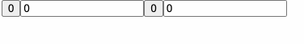
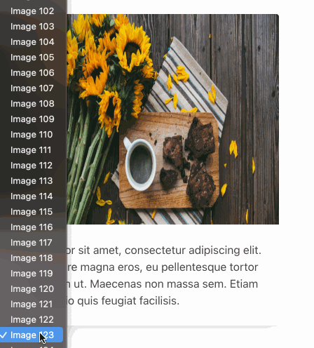
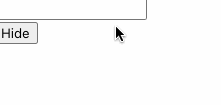
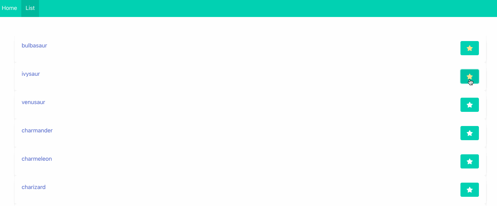

# Services

### MyShareService

Gebruik de Counter Component uit de vorige oefeningen (met de button) en geef deze component 2x weer op het scherm.&#x20;

* Test de knoppen.&#x20;
* Je zal merken dat beide componenten onafhankelijk werken en dat de beide componenten (uiteraard) elk een eigen counter hebben.
* We willen nu deze beiden laten samenwerken via een service zodat de beiden steeds dezelfde counter gebruiken en dus dezelfde waarde weergeven op de buttons.
* Maak een nieuwe service aan: MyShareService
* Gebruik deze in de Calculator Component (via dependency injection)&#x20;
* Verhuis de ‘counter’ property vanuit de component naar de service
* Maak in de component hiervoor een ‘get’ter => get counter() die de waarde ophaalt uit de service
* Test opnieuw.&#x20;
* De componenten gebruiken nu beiden dezelfde counter die zich in de service bevindt. Ze geven beide dus steeds dezelfde waarden aan

### WelcomeComponent

* Maak een nieuwe component aan :&#x20;
  * WelcomeSelectComponent
* Geef deze component weer op het scherm net boven de WelcomeComponent&#x20;
* Deze zal enkel de dropdown (select) lijst bevatten die zich in de WelcomeComponent bevindt (kopieer deze daar uit)
* Zorg er met een service voor dat je ook met deze dropdown de afbeelding in de WelcomeComponent kan aanpassen
* Zorg er bovendien voor dat het in beide richtingen werkt.&#x20;
* Dus welke lijst ook wordt aangepast, beiden zullen steeds dezelfde image tonen.

### Lifecycle

* Maak een component TextComponent aan.&#x20;
  * Deze bevat een text field (input text)&#x20;
  * Heeft een property "text"
  * Als de textfield aangepast wordt wordt de property mee aangepast (gebruik 2 way binding)
* Maak een component TextToggleComponent aan
  * Deze bevat de TextComponent
  * Maak een property visible
  * Twee buttons.&#x20;
    * 1 button zorgt ervoor dat de TextComponent getoond wordt
    * 1 button zorgt ervoor dat de TextComponent verborgen wordt
    * Gebruik hiervoor ngIf
* Merk op wat er gebeurd met de text die je in de input field hebt ingegeven.

* Implementeer de OnInit, OnDestroy methodes in het TextComponent en plaats een console.log om te zien wanneer deze aangeroepen wordt.
  * Kan je dan verklaren waren de text verdwijnt?
* Maak een service TextService
  * Plaats de text property in deze service.
  * Pas je TextComponent aan zodat het deze service gebruikt
* Ga nu na wat er gebeurd met de text in het input field.

### PokedexService

* Maak een nieuwe service PokedexService
* Zorg dat het inlezen van de pokemon json via deze service verloopt.
  * Zorg voor een getter voor alle pokemon op te vragen
  * Zorg voor een functie `getPokemonById` die de pokemon teruggeeft met een bepaalde id
* Pas de applicatie aan zodat alle componenten deze service gebruiken.
* Maak een uitbreiding op de Pokedex applicatie zodat we onze favoriete pokemon kunnen "favouriten"
  * Voeg een button toe bij elke pokemon
  * Voorzie een property voor aan de duiden of een pokemon favourite is of niet.
  * Voorzie een functie in de PokedexService om een pokemon favoriet te maken en terug weg te doen.
  * De favourite button moet er anders uitzien als de pokemon favourite is of niet
* In de detail pagina moet je ook kunnen zien of een pokemon favourite is of niet.

